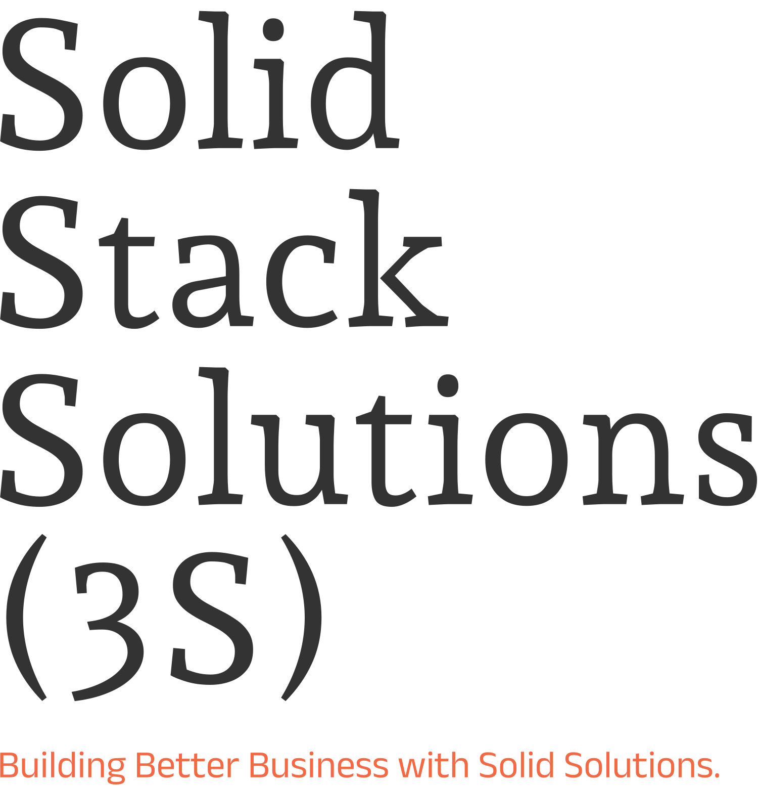

<div style="align-items: center; padding: 55px;background-color: #232125; ">
 

<div style="padding: 55px;background-color:whitesmoke;>



</div>
<br>
<br>

# Mortgage calculator:

### Project Plan: Mortgage Calculator App
#### Overview   
[](https://github.com/TheGreatJordach/mortgage-backend/actions/workflows/CI.yml)
[](https://github.com/TheGreatJordach/mortgage-backend/actions/workflows/quality-code-scan.yml)
[](https://github.com/TheGreatJordach/mortgage-backend/actions/workflows/deploy.yml)

> 💡 Developing a mortgage calculator application consisting of a frontend and backend. The frontend will handle user interaction and display calculation results. The backend will provide API endpoints for calculations and data storage.


#### Project owner: Challenge on > 💎 [Front end Mentor](https://www.frontendmentor.io/pro?ref=style-guide)

1. **Technology stack**:
---
- **Frontend:** TypeScript
- **Backend:** NestJS, TypeORM
- **Database:** MySQL (development), PostgreSQL (production)
- **Deployment:** Vercel
- **Unit Test:**: To be define
- **E2E Test**: To be define
- **Code Quality**: SonarCloud
- **CI/CD**: GitHub Actions

2. **Application Features**:
---
   - **UI**:
       - GUI for taking mortgage amount, term, interest rate, and mortgage type (repayment or interest-only)
       - Calculation of mortgage repayments based on input parameters.
       - Display of calculation results to the user.
       - User authentication for storing calculation results
       - Storage of calculation results in a database for later retrieval.
       - Optional: Display calculation results in graphical format.
       
  - **UI Style Guide:**
     - **Layout.** : The designs were created to the following widths:
        - Mobile: 375px
        - Desktop: 1440px
     - **Colors.**
        - Primary
            - Lime: hsl(61, 70%, 52%)
            - Red: hsl(4, 69%, 50%)
        - Neutral
           - White: hsl(0, 0%, 100%)
           - Slate 100: hsl(202, 86%, 94%)
           - Slate 300: hsl(203, 41%, 72%)
           - Slate 500: hsl(200, 26%, 54%)
           - Slate 700: hsl(200, 24%, 40%)
           - Slate 900: hsl(202, 55%, 16%)    
    - **Font.**
           - Family: [Plus Jakarta Sans](https://fonts.google.com/specimen/Plus+Jakarta+Sans)
           - Weights: 500, 700
           - Font size (paragraph): 16px (body)
     

> 💡 These are just the design sizes. Ensure content is responsive and meets WCAG requirements by testing the full range of screen sizes from 320px to large screens.


<br> 
<div>

</div>
<br> 


   - **Project Structure**:
      - **Separate repositories: One for frontend and one for backend.**:
   - **Backend API endpoints:**:
      - ** Mortgage calculation endpoint (public)**:
      - **User authentication and authorization endpoint**:
      - **ser mortgage data management endpoint (protected)**:
   -  **Backend entities:**:
       - **User (with authentication information)**
       - **MortgageCalculation (with calculation details and foreign key to User)**
  
 3. **Development Approach**:
 ---
 
   - **Dev**:
       - **Start with back-end dev, focusing on the MortgageCalculation entity and its associated logic.**
       - **Implement the mortgage calculation endpoint.**
       - **Develop the frontend to consume the backend API.**
       - **Implement user authentication and data storage features.**
      
   - **Deployment**:
       - **Deploy both frontend and backend to Vercel.**
       - **Utilize Vercel's PostgreSQL database for production.**
  

 4. **Additional Considerations**:
   ---
   
   - **Implement robust error handling and input validation.**
   - **Optimize performance for complex calculations or large datasets.**
   - **Prioritize security, especially for user data.**
   - **Checkout**
   - **Checkout**


## BACKEND Installation

<p align="center">
  <a href="http://nestjs.com/" target="blank"></a>
</p>

 
## Installation

```bash
$ npm install
```

## Running the app

```bash
# development
$ npm run start

# watch mode
$ npm run start:dev

# production mode
$ npm run start:prod
```

## Test

```bash
# unit tests
$ npm run test

# e2e tests
$ npm run test:e2e

# test coverage
$ npm run test:cov
```

## Support

Nest is an MIT-licensed open source project. It can grow thanks to the sponsors and support by the amazing backers. If you'd like to join them, please [read more here](https://docs.nestjs.com/support).

## Stay in touch

- Author - [Jordach MAKAYA](https://kamilmysliwiec.com)
- E-Mail me ! - solidstacksolutions@gmail.com

## License

Nest is [MIT licensed](LICENSE).


</div>
